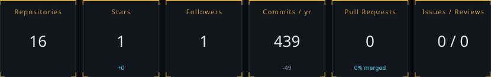

<picture>
  <source media="(prefers-color-scheme: dark)" srcset="assets/generated/header-dark.svg">
  <source media="(prefers-color-scheme: light)" srcset="assets/generated/header-light.svg">
  
</picture>

Full-stack developer working across the stack from React front ends to FastAPI and PostgreSQL backends, with a research focus on large language model agents. Recent work spans entity resolution at scale for the Amazon ML Challenge, safety evaluation of small LLM agents, and applied NLP tools that turn dense documents into plain-language answers.

 

<picture>
  <source media="(prefers-color-scheme: dark)" srcset="assets/generated/overview-dark.svg">
  <source media="(prefers-color-scheme: light)" srcset="assets/generated/overview-light.svg">
  
</picture>

<table>
<tr>
<td width="50%">
<picture>
  <source media="(prefers-color-scheme: dark)" srcset="assets/generated/activity-chart-dark.svg">
  <source media="(prefers-color-scheme: light)" srcset="assets/generated/activity-chart-light.svg">
  
</picture>
</td>
<td width="50%">
<picture>
  <source media="(prefers-color-scheme: dark)" srcset="assets/generated/languages-dark.svg">
  <source media="(prefers-color-scheme: light)" srcset="assets/generated/languages-light.svg">
  
</picture>
</td>
</tr>
<tr>
<td width="50%">
<picture>
  <source media="(prefers-color-scheme: dark)" srcset="assets/generated/streak-dark.svg">
  <source media="(prefers-color-scheme: light)" srcset="assets/generated/streak-light.svg">
  
</picture>
</td>
<td width="50%">
<picture>
  <source media="(prefers-color-scheme: dark)" srcset="assets/generated/weekly-rhythm-dark.svg">
  <source media="(prefers-color-scheme: light)" srcset="assets/generated/weekly-rhythm-light.svg">
  
</picture>
</td>
</tr>
</table>

<picture>
  <source media="(prefers-color-scheme: dark)" srcset="assets/generated/contributions-dark.svg">
  <source media="(prefers-color-scheme: light)" srcset="assets/generated/contributions-light.svg">
  
</picture>

  

### Technologies

 

### Selected Work

<table>
<tr>
<td width="50%">
<a href="https://github.com/ManavSharma2707/Amazon-ML-Hackathon">
<picture>
  <source media="(prefers-color-scheme: dark)" srcset="assets/generated/project-0-dark.svg">
  <source media="(prefers-color-scheme: light)" srcset="assets/generated/project-0-light.svg">
  
</picture>
</a>
</td>
<td width="50%">
<a href="https://github.com/ManavSharma2707/AgenticSafety-Research">
<picture>
  <source media="(prefers-color-scheme: dark)" srcset="assets/generated/project-1-dark.svg">
  <source media="(prefers-color-scheme: light)" srcset="assets/generated/project-1-light.svg">
  
</picture>
</a>
</td>
</tr>
<tr>
<td width="50%">
<a href="https://github.com/maxoutlabs/omninpc">
<picture>
  <source media="(prefers-color-scheme: dark)" srcset="assets/generated/project-2-dark.svg">
  <source media="(prefers-color-scheme: light)" srcset="assets/generated/project-2-light.svg">
  
</picture>
</a>
</td>
<td width="50%">
<a href="https://github.com/ManavSharma2707/Cognitia">
<picture>
  <source media="(prefers-color-scheme: dark)" srcset="assets/generated/project-3-dark.svg">
  <source media="(prefers-color-scheme: light)" srcset="assets/generated/project-3-light.svg">
  
</picture>
</a>
</td>
</tr>
</table>

 

<picture>
  <source media="(prefers-color-scheme: dark)" srcset="assets/generated/snake-dark.svg">
  <source media="(prefers-color-scheme: light)" srcset="assets/generated/snake.svg">
  
</picture>

<strong>More about me</strong>

 

I work across the stack, from data pipelines and model training to the interfaces people actually use. Most of my recent time goes toward two things: shipping full-stack products end to end, and researching how language model agents behave and fail under realistic conditions.

 

### Contact

Reach out on [LinkedIn](https://www.linkedin.com/in/manav-sharma-ab750432a) or by [email](mailto:manav2707sharma@gmail.com), or see the full breakdown on the **[interactive dashboard →](https://manavsharma2707.github.io)**

Metrics refresh daily. Last updated automatically by GitHub Actions.

